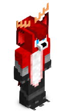
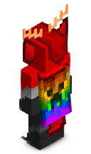
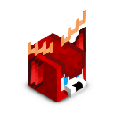
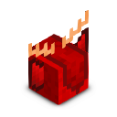

# NickAc's Minecraft Skin Renderer

A speedy and fairly-accurate Minecraft avatar renderer service.

A hosted version of NMSR is available [here](https://nmsr.nickac.dev/). It's
provided on a best-effort basis, so please don't abuse it.

NMSR supports custom render parameters, player armour, armour trims, many render
modes, native Ears mod support and Minecraft capes.

## Getting Started

Moving off from a different avatar service? _We've got you covered._ Self-hosting NMSR is easy as _**1**, **2**, **3**_!

### Docker

1. Clone the repository and rename the `example.config.toml` file to `config.toml`.
2. Run `docker build -t nmsr .`
3. Run `docker run -p 8080:8080 nmsr`

### No Docker

1. Clone the repository.
2. Run `cargo run --release --bin nmsr-aas`
3. You're done! The service is now running on `http://localhost:8080`.

## Supported render modes

<table>
    <thead>
        <tr>
            <th>Category</th>
            <th>Render Mode</th>
            <th>Description</th>
            <th>Example</th>
            <th>Example (Back)</th>
        </tr>
    </thead>
    <tbody>
        <tr>
            <td rowspan="5">Body</td>
            <td>FullBody</td>
            <td>Full body render</td>
            <td></td>
            <td></td>
        </tr>
        <tr>
            <td>FullBodyIso</td>
            <td>Full body isometric render</td>
            <td></td>
            <td></td>
        </tr>
        <tr>
            <td>BodyBust</td>
            <td>Body bust render</td>
            <td></td>
            <td></td>
        </tr>
        <tr>
            <td>FrontBust</td>
            <td>Bust isometric front render</td>
            <td></td>
            <td></td>
        </tr>
        <tr>
            <td>FrontFull</td>
            <td>Full isometric front render</td>
            <td></td>
            <td></td>
        </tr>
        <tr>
            <td rowspan="3">Head</td>
            <td>Head</td>
            <td>Head render</td>
            <td></td>
            <td></td>
        </tr>
        <tr>
            <td>HeadIso</td>
            <td>Head isometric render</td>
            <td></td>
            <td></td>
        </tr>
        <tr>
            <td>Face</td>
            <td>Face render</td>
            <td></td>
            <td></td>
        </tr>
        <tr>
            <td rowspan="2">Extra</td>
            <td>Skin</td>
            <td colspan="4">Player skin</td>
        </tr>
        <tr>
            <td>Custom</td>
            <td colspan="4">Custom render settings</td>
        </tr>
    </tbody>
</table>

##### _Examples shown are of the author's skin, rendered using the `ears` feature enabled._

## Crates

Since this project contains a few crates, here's a short explanation for each.

### `nmsr-aas` - NickAc's Minecraft Skin Renderer as a Service

The star of the show. This is the service that does the actual rendering. If you're looking to self-host NMSR, this is the crate you're looking for.

### `nmsr-3d-renderer/nmsr-player-parts` - Player parts provider

Abstraction of a Minecraft player model. This serves as a base for the 3d model cubes and quads.

When compiled with the `ears` feature, it also provides Ears mod support.

### `nmsr-3d-renderer/nmsr-rendering` - 3D rendering

The actual 3D rendering engine. This is where the magic happens. Implemented using `wgpu-rs` which allows for plugging many different rendering backends.

### `nmsr-lib` - UV map library

This is the (now legacy) UV map library. This used to do the actual "rendering"
in previous versions. It requires pre-rendered images to be provided.

Currently, it uses version 2 of the UV map layout instead of the previous
format.

For more information on the UV map layout, see [here](#uv-map-layouts).

### `utils/**` - Utilities

Crates in this directory are provided as-is and some may or may not be maintained.

Contains experiments that could be promoted to officially supported crates in the future.

### nmsr-jni

This is the JNI library, which contains the native code for invoking the skin
renderer from the JVM.

## UV map layouts

### Version 2
This is the current version of the UV map layout. It's an 8-bit RGBA image.
It improves on the previous version by not being wasteful with the bits, at the cost of being more complex.

    <!--Our Red channel is composed of the 6 bits of the u coordinate + 2 bits from the v coordinate
    U is used as-is because our coordinates are 0-63
    0   1   2   3   4   5   6   7
    [    ---- u ----    ]   [ v ]
    Our Green channel is composed of the 4 remaining bits of the v coordinate + 4 bits from the shading
    V is used as-is because our coordinates are 0-63
    0   1   2   3   4   5   6   7
    [  -- v --  ]   [  -- s --  ]
    Our Blue channel is composed of the 4 remaining bits of the shading + 4 bits from the depth
    0   1   2   3   4   5   6   7
    [  -- s --  ]   [  -- d --  ]
    Our Alpha channel is composed of the 8 remaining bits of the depth
    0   1   2   3   4   5   6   7
    [          -- d --          ]-->
    
UV map layout v2

    <table>
    <tbody>
        <tr>
            <th align="center" colspan="8">R</td>
            <th align="center" colspan="8">G</td>
            <th align="center" colspan="8">B</td>
            <th align="center" colspan="8">A</td>
        </tr>
        <tr>
            <td align="center">0</td>
            <td align="center">1</td>
            <td align="center">2</td>
            <td align="center">3</td>
            <td align="center">4</td>
            <td align="center">5</td>
            <td align="center">6</td>
            <td align="center">7</td>
            <td align="center">8</td>
            <td align="center">9</td>
            <td align="center">10</td>
            <td align="center">11</td>
            <td align="center">12</td>
            <td align="center">13</td>
            <td align="center">14</td>
            <td align="center">15</td>
            <td align="center">16</td>
            <td align="center">17</td>
            <td align="center">18</td>
            <td align="center">19</td>
            <td align="center">20</td>
            <td align="center">21</td>
            <td align="center">22</td>
            <td align="center">23</td>
            <td align="center">24</td>
            <td align="center">25</td>
            <td align="center">26</td>
            <td align="center">27</td>
            <td align="center">28</td>
            <td align="center">29</td>
            <td align="center">30</td>
            <td align="center">31</td>
        </tr>
        <tr>
            <th align="center" colspan="6">U</td>
            <th align="center" colspan="6">V</td>
            <th align="center" colspan="8">Shading</td>
            <th align="center" colspan="12">Depth</td>
        </tr>
    </tbody>
    </table>

### Version 1
This is the previous version of the UV map layout. It's a 16-bit RGBA image.
It's wasteful with the bits, but it's simple.

If you're looking for the last commit that used this UV map layout, checkout
commit
[`e62100095a7fcdc83c989a4fb603866cf338edca`](https://github.com/NickAcPT/nmsr-rs/tree/e62100095a7fcdc83c989a4fb603866cf338edca).

    
UV map layout v1

    <table>
    <tbody>
        <!-- 
            (16 bit RGBA)
            R - U coordinate (Horizontal, X)
            G - 100% - V coordinate (Vertical, Y)
            B - Depth - unused here
            A - Normal alpha
            -->
            <tr>
            <th align="center" colspan="16">R</td>
            <th align="center" colspan="16">G</td>
            <th align="center" colspan="16">B</td>
            <th align="center" colspan="16">A</td>
        </tr>
        <tr>
            <td align="center">0</td>
            <td align="center">1</td>
            <td align="center">2</td>
            <td align="center">3</td>
            <td align="center">4</td>
            <td align="center">5</td>
            <td align="center">6</td>
            <td align="center">7</td>
            <td align="center">8</td>
            <td align="center">9</td>
            <td align="center">10</td>
            <td align="center">11</td>
            <td align="center">12</td>
            <td align="center">13</td>
            <td align="center">14</td>
            <td align="center">15</td>
            <td align="center">16</td>
            <td align="center">17</td>
            <td align="center">18</td>
            <td align="center">19</td>
            <td align="center">20</td>
            <td align="center">21</td>
            <td align="center">22</td>
            <td align="center">23</td>
            <td align="center">24</td>
            <td align="center">25</td>
            <td align="center">26</td>
            <td align="center">27</td>
            <td align="center">28</td>
            <td align="center">29</td>
            <td align="center">30</td>
            <td align="center">31</td>
            <td align="center">32</td>
            <td align="center">33</td>
            <td align="center">34</td>
            <td align="center">35</td>
            <td align="center">36</td>
            <td align="center">37</td>
            <td align="center">38</td>
            <td align="center">39</td>
            <td align="center">40</td>
            <td align="center">41</td>
            <td align="center">42</td>
            <td align="center">43</td>
            <td align="center">44</td>
            <td align="center">45</td>
            <td align="center">46</td>
            <td align="center">47</td>
            <td align="center">48</td>
            <td align="center">49</td>
            <td align="center">50</td>
            <td align="center">51</td>
            <td align="center">52</td>
            <td align="center">53</td>
            <td align="center">54</td>
            <td align="center">55</td>
            <td align="center">56</td>
            <td align="center">57</td>
            <td align="center">58</td>
            <td align="center">59</td>
            <td align="center">60</td>
            <td align="center">61</td>
            <td align="center">62</td>
            <td align="center">63</td>
        </tr>
        <tr>
            <th align="center" colspan="16">U</td>
            <th align="center" colspan="16">V (100% - V coordinate)</td>
            <th align="center" colspan="16">Depth</td>
            <th align="center" colspan="16">Alpha</td>
        </tr>
    </tbody>
    </table>

